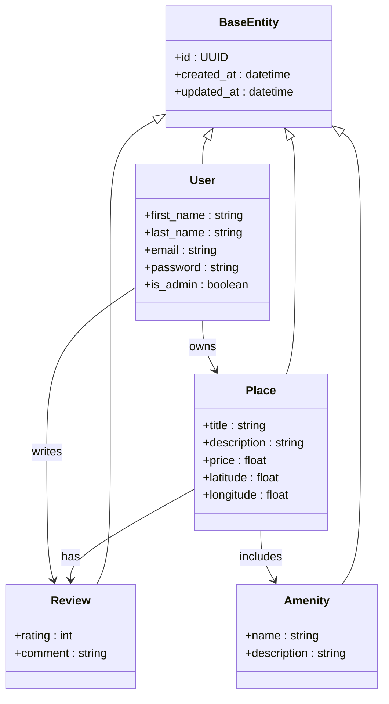

The HBnB Evolution project is a modular application that follows a layered architecture to ensure maintainability and scalability.

The purpose of this document is to describe the core entities of the Business Logic Layer.

It contains a class diagram detailing the system’s main domain models, their attributes, inheritance relationships, and associations.

Business Logic Layer – Class Diagram

This diagram describes the core entities of the HBnB Business Logic layer.

All entities inherit from BaseEntity, which provides a unique identifier and timestamps for audit purposes.

The relationships between entities reflect the business rules, including ownership of places, user reviews, and place amenities.