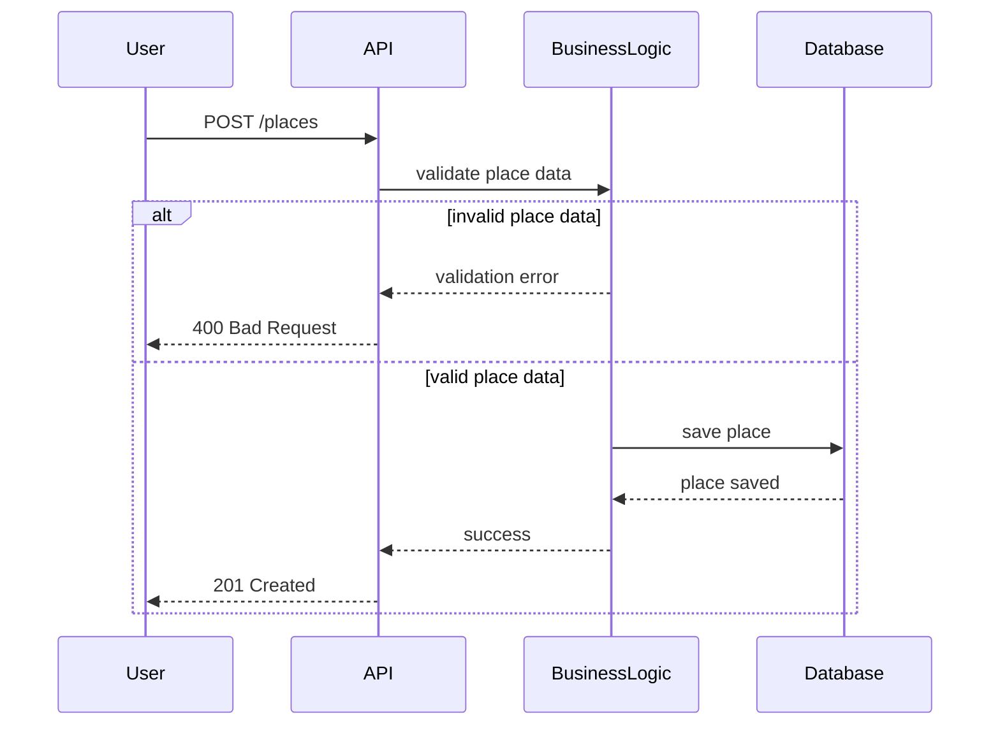

The HBnB Evolution project allows authenticated users to create and manage property listings.
The purpose of this document is to describe how a new place is created within the system.
It contains a sequence diagram that shows the interactions between system components during place creation, including input validation and possible error responses.

Place Creation Sequence

This sequence diagram shows how a new place is created.

Invalid input data is rejected by the Business Logic layer.

Valid place data is saved in the database and confirmed to the user.