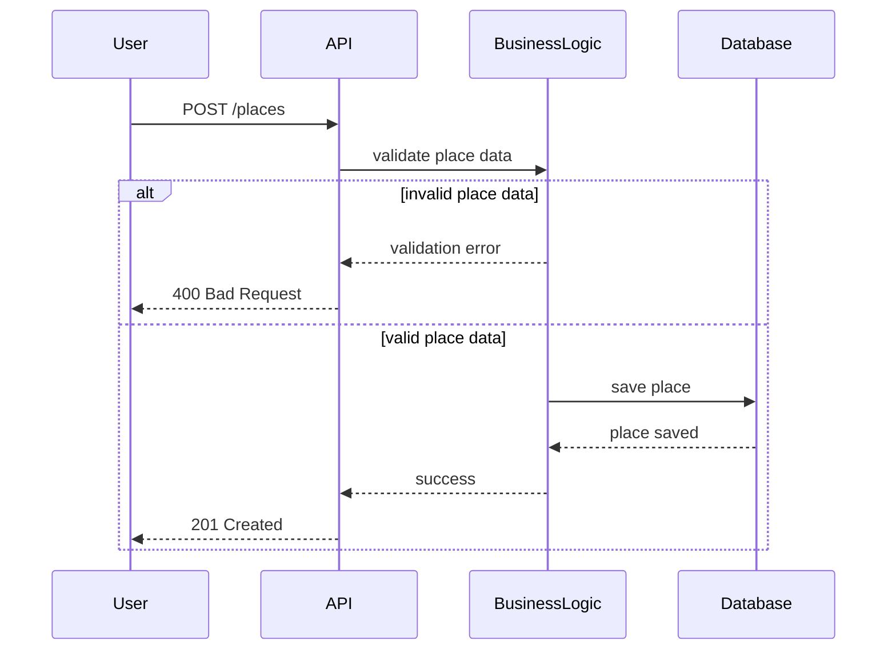

Place Creation Sequence

This sequence diagram shows how a new place is created.

Invalid input data is rejected by the Business Logic layer.

Valid place data is saved in the database and confirmed to the user.