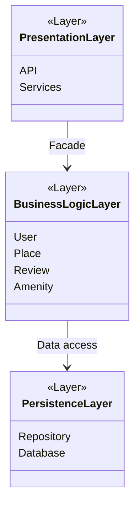

The HBnB Evolution project is a web-based application designed to manage users, places, reviews, and amenities using a structured layered architecture.

The purpose of this document is to present the high-level architectural design of the system.

It contains a package diagram illustrating the separation of concerns between the Presentation Layer, the Business Logic Layer, and the Persistence Layer.

High-Level Architecture Overview

This diagram presents the overall architecture of the HBnB Evolution application, which follows a three-layered architecture.

The Presentation Layer handles user interactions through APIs and services.

The Business Logic Layer contains the core domain models and enforces business rules. It is accessed through a Facade to simplify communication.

The Persistence Layer is responsible for storing and retrieving data from the database.

This architecture ensures separation of concerns, maintainability, and scalability.