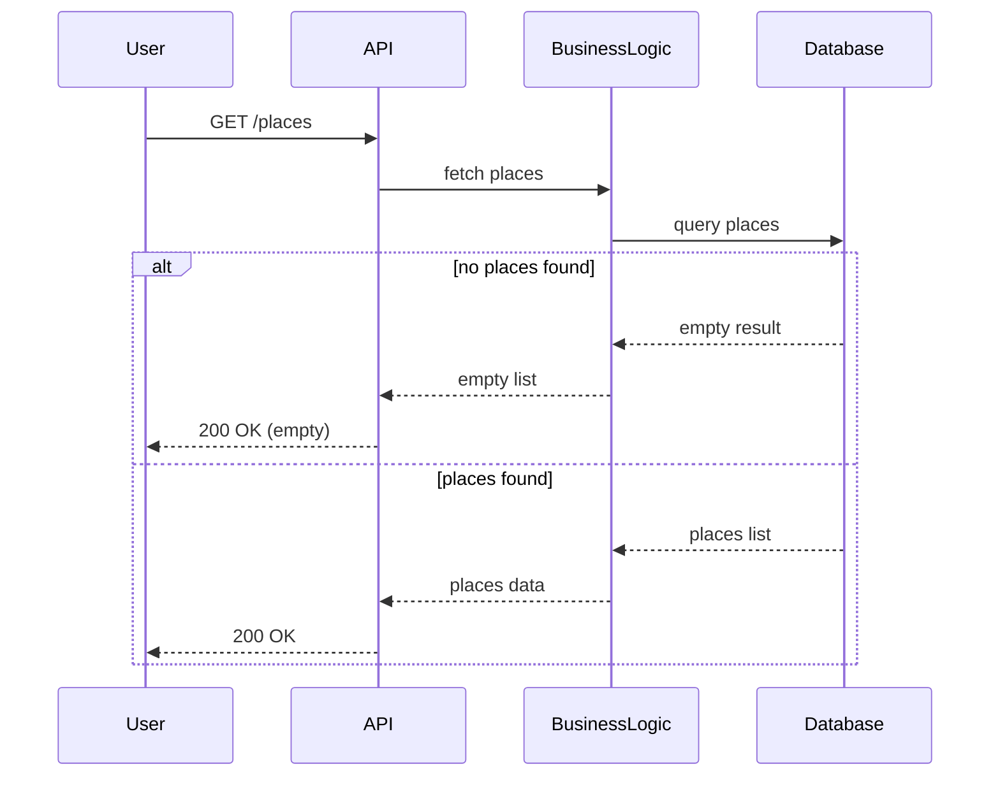

The HBnB Evolution project provides users with the ability to browse available places.
The purpose of this document is to describe how the system retrieves and returns a list of places.
It contains a sequence diagram showing the interaction between the User, API, Business Logic, and Database layers, including the case where no places are found.

Fetching Places Sequence

This diagram illustrates how a list of places is retrieved.

If no places are found, an empty list is returned.

This approach ensures consistent behavior while maintaining a clear separation of responsibilities.