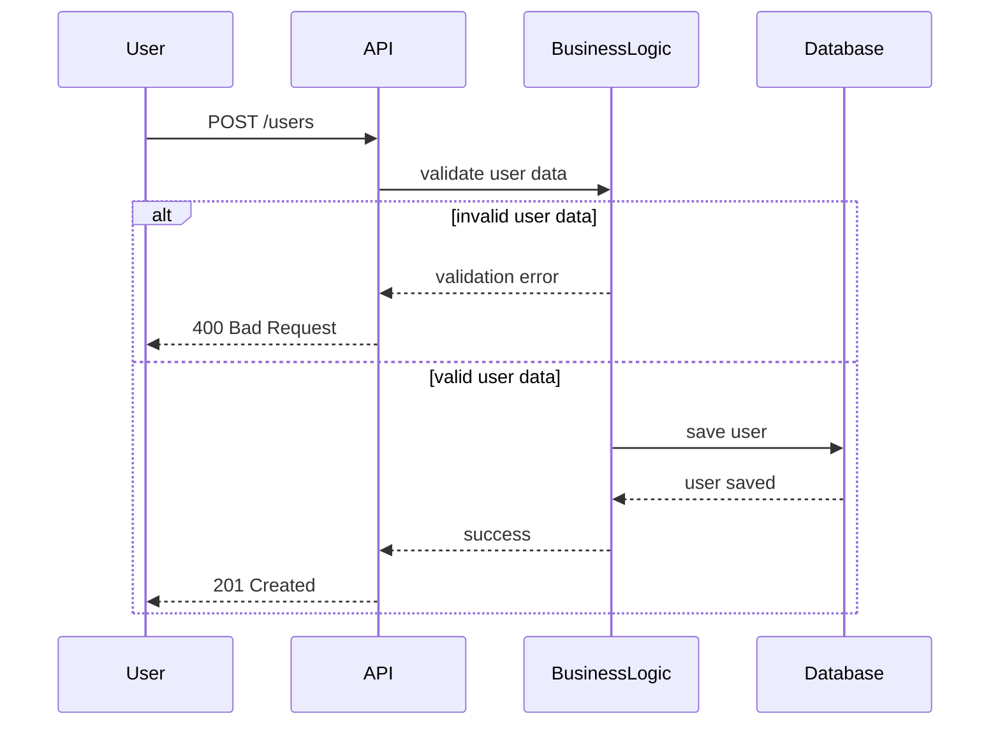

The HBnB Evolution project is a web-based application designed to manage users, places, reviews, and amenities using a structured layered architecture.
The purpose of this document is to present the high-level architectural design of the system.
It contains a package diagram illustrating the separation of concerns between the Presentation Layer, the Business Logic Layer, and the Persistence Layer.

This diagram represents the submission of a review for a place.

The Business Logic layer validates the review data and ensures that the place exists.

If validation fails, an error response is returned. Otherwise, the review is stored successfully.