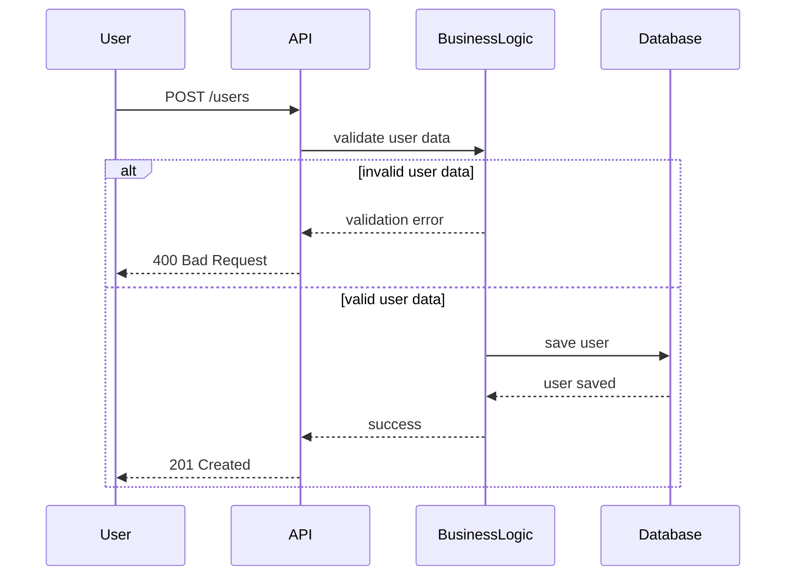

User Registration Sequence

This diagram illustrates the user registration process.

The Business Logic layer validates the input data. If the data is invalid, an error response is returned.

If the data is valid, the user is persisted in the database and a success response is sent.