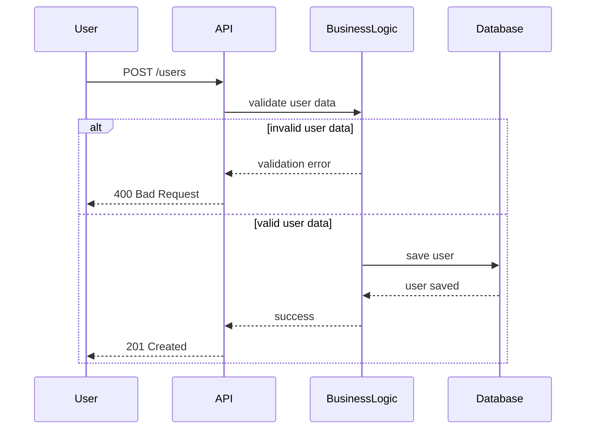

The HBnB Evolution project manages users and property listings through a structured multi-layered system.
The purpose of this document is to describe the dynamic behavior of the system during the user registration process.
It contains a sequence diagram illustrating the interaction between the User, API, Business Logic layer, and Database, including validation and error handling.

User Registration Sequence

This diagram illustrates the user registration process.

The Business Logic layer validates the input data. If the data is invalid, an error response is returned.

If the data is valid, the user is persisted in the database and a success response is sent.