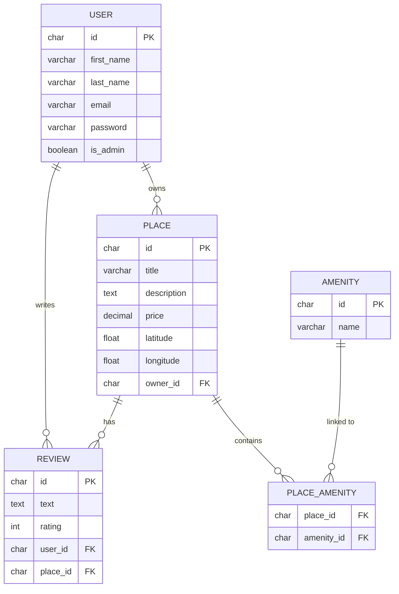

# HBnB — Entity-Relationship Diagram

# HBnB — Entity-Relationship Diagram

## Légende

### Symboles de relation
| Notation | Signification |
|---|---|
| `\|\|` | Exactement **un** (obligatoire) |
| `o{` | **Zéro ou plusieurs** (optionnel) |
| `\|\|--o{` | Un à plusieurs |

### Clés
| Badge | Signification |
|---|---|
| `PK` | Clé primaire — identifiant unique de la table |
| `FK` | Clé étrangère — référence une autre table |

### Relations du schéma
| Relation | Type | Description |
|---|---|---|
| USER → PLACE | 1 à plusieurs | Un user peut posséder plusieurs places |
| USER → REVIEW | 1 à plusieurs | Un user peut écrire plusieurs avis |
| PLACE → REVIEW | 1 à plusieurs | Une place peut avoir plusieurs avis |
| PLACE ↔ AMENITY | Plusieurs à plusieurs | Via la table de liaison PLACE_AMENITY |

> Un user ne peut laisser qu'**un seul avis par place** (contrainte `UNIQUE` sur `user_id + place_id`).