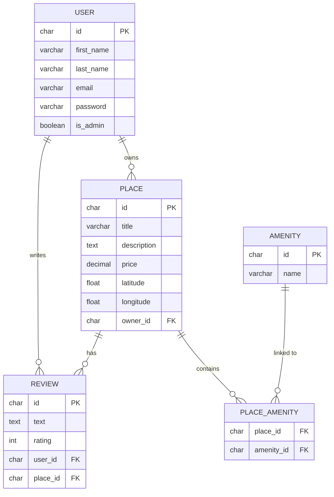

# HBnB — Entity-Relationship Diagram

```mermaid
erDiagram
  USER {
    char id PK
    varchar first_name
    varchar last_name
    varchar email
    varchar password
    boolean is_admin
  }
  PLACE {
    char id PK
    varchar title
    text description
    decimal price
    float latitude
    float longitude
    char owner_id FK
  }
  REVIEW {
    char id PK
    text text
    int rating
    char user_id FK
    char place_id FK
  }
  AMENITY {
    char id PK
    varchar name
  }
  PLACE_AMENITY {
    char place_id FK
    char amenity_id FK
  }
  USER ||--o{ PLACE : "owns"
  USER ||--o{ REVIEW : "writes"
  PLACE ||--o{ REVIEW : "has"
  PLACE ||--o{ PLACE_AMENITY : "contains"
  AMENITY ||--o{ PLACE_AMENITY : "linked to"
```